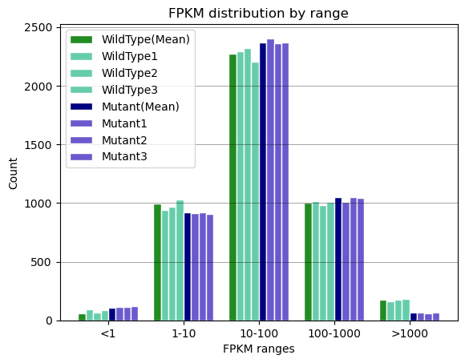
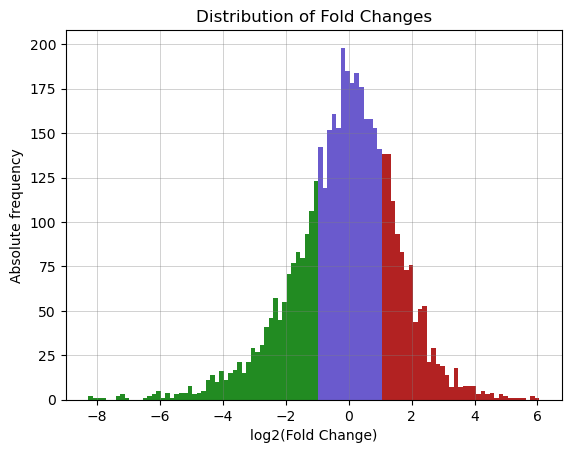

# Problem 2: RNA-seq analysis 🧬
For this problem, we had several data files, such as BAM files📄, txt files with read counts and FPKM correction📄 and a Differential Expression analysis file📄. 
Some of the steps needed to solve the diverse questions and objectives we were asked to adress were solved with the following: 

## 📁 `FPKMs_plotting`
- 📄 `gene_count_fpkm.txt`: FPKM values for each gene and for each replica of the experiment. It is the input.
- 💻 `FPKM_barplot.py`: script that plots the distribution📈 of FPKMs in all the replicas.
- 🎨 `plt_FPKM.png`: FPKM distribution plotted. Showed here:

## 📁 `FoldChange_plotting`
- 📄 `Mutant_vs_WildType_results.txt`: file with normalized FPKMs for each replica, with calculated fold change (FC) and p-value. 
- 💻 `FC_histplot.py`: script that plots the distribution📈 of the fold changes, regardless of their p-value. 
- 🎨 `plt_FC.png`: FC distribution plotted.

  
## 📁 `COG_terms`
- 📄 `Locus_tag_filtered_results.txt`: locus tags for each gene that has been defined as differentially expressed in our data (previously filtering⌨️ made). It is one of the inputs.
- 📄 `Stenotrophomonas_maltophilia_K279a_ASM7248v1_genomic.g2d.COG`: COG (Clusters of Orthologous Genes) terms for each gene of the reference S. maltophilia K279a genome. It is one of the inputs. Retrieved from: [Genome2D webserver](http://genome2d.molgenrug.nl/).
- 💻 `COGs.py`: script that mathches the COG terms to our DEGs.
- 📄 `DEGs_with_COGs.csv`: csv output file with each DEG and its COG term.
